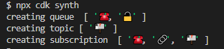

# Welcome to your CDK TypeScript project

This is a blank project for CDK development with TypeScript.

The `cdk.json` file tells the CDK Toolkit how to execute your app.

## Useful commands

* `npm run build`   compile typescript to js
* `npm run watch`   watch for changes and compile
* `npm run test`    perform the jest unit tests
* `cdk deploy`      deploy this stack to your default AWS account/region
* `cdk diff`        compare deployed stack with current state
* `cdk synth`       emits the synthesized CloudFormation template

## What does it look like?  

## Why would I do this?

It appears we can [process images](https://movableink.com/blog/29-incredible-stats-that-prove-the-power-of-visual-marketing) faster than text. 

So in order to interpret the stages of our Pipeline correctly we can add [Emoji's](https://medium.com/@manuerumx/ci-cd-with-emojis-3be9db23d3df)

It's important we use them [effectively](https://oit.williams.edu/files/2010/02/using-images-effectively.pdf)
